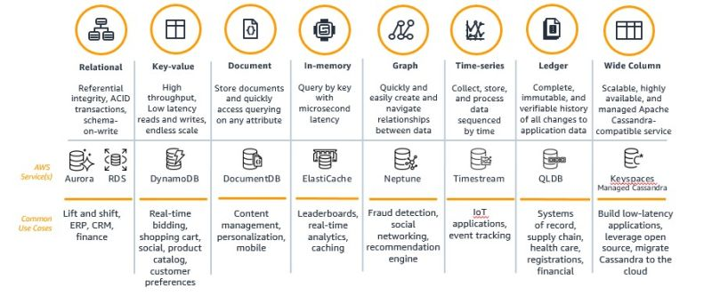

## How to choose DB

### Integration
The most important thing to consider while choosing the right database is what system you need to integrate together? Make sure that your database management system can be integrated with other tools and services within your project. Different technologies have different connectors for different other technologies. For example, if you have a big analytics job that’s currently running an Apache spark then probably you want to limit yourself to external databases that can connect easily to apache spark.

### Scaling Requirement
It’s important to know the scaling requirement before installing your production database. How much data are you really talking about? Is it really going to grow unbounded over time? if so then you need some sort of database technology that is not limited to the data that you can store on one PC. You need to look at something like Cassandra or MongoDB or HBase where you can actually distribute the storage of your data across an entire cluster and scale horizontally instead of vertically.

While choosing a database you also need to think about the transaction rate or throughput which means how many requests you intend to get per second. Databases with high throughput can support many simultaneous users. If we are talking about thousands then again a single database service is not going to work out. This is especially important when you are working on some big websites where we have a lot of web servers that are serving a lot of people at the same time. You will have to choose a database that is distributed and allows you to spread out a load of those transactions more evenly. In those situations, NoSQL databases are a good choice instead of RDBMS.

### Support Consideration
Think about the supports you might need for your database. Do you have the in-house expertise to spin up this new technology and actually configure it properly? It’s going to be harder than you think especially if you’re using this in the real world or any sort of situation where you have personally identifiable information in the mix from your end-users. In that case, you need to make sure you’re thinking about the security of your system. The truth is most of the NoSQL database we’ve talked about if you configure them with their default settings there will be no security at all.

### CAP Consideration
CAP stands for Consistency, Availability, and Partition tolerance. The theorem states that you cannot achieve all the properties at the best level in a single database, as there are natural trade offs between the items. You can only pick two out of three at a time and that totally depends on your prioritize based on your requirements. For example, if your system needs to be available and partition tolerant, then you must be willing to accept some latency in your consistency requirements. Traditional relational databases are a natural fit for the CA side whereas Non-relational database engines mostly satisfy AP and CP requirements.

**Consistency** means that any read request will return the most recent write. Data consistency is usually “strong” for SQL databases and for NoSQL database consistency may be anything from “eventual” to “strong”.

**Availability** means that a non-responding node must respond in a reasonable amount of time. Not every application needs to run 24/7 with 99.999% availability but most likely you will prefer a database with higher availability.

**Partition tolerance** means the system will continue to operate despite network or node failures.

### Schemas or Data Model
Relational databases store data in a fixed and predefined structure. It means when you start development you will have to define your data schema in terms of tables and columns. You have to change the schema every time the requirements change. This will lead to creating new columns, defining new relations, reflecting the changes in your application, discussing with your database administrators, etc. NoSQL database provides much more flexibility when it comes to handling data. There is no requirement to specify the schema to start working with the application. Also, the NoSQL database doesn’t put a restriction on the types of data you can store together. It allows you to add more new types as your needs change. In the application building process, most of the developers prefer high coding velocity and great agility. NoSQL databases have proven to be a much better choice in that regard especially for agile development which requires fast implementation.

## Types of DB
You have a variety of options available in relational (MySQL, PostgreSQL, Oracle DB, etc) and non-relational (MongoDB, Apache HBase, Cassandra, etc) database but you need to understand none of them fits on all kinds of projects requirement. Each one of them has some strengths and weaknesses.

Databases through two lenses: access characteristics and the pattern of the data being stored.

### Relational
With large spans of usage, relational databases are still the dominant database type today. A relational database is self-describing because it enables developers to define the database's schema as well as relations and constraints between rows and tables in the database. Developers rely on the functionality of the relational database and not the application code to enforce the schema and preserve the referential integrity of the data within the database. Typical use cases for a relational database include web and mobile applications, enterprise applications, and online gaming. Various flavors or versions of Amazon RDS and Amazon Aurora are used by startups for high-performance and scalable applications on AWS. Both RDS and Aurora are fully managed, scalable systems.

#### MySQL
Relational (+Document since 5.7.8)
SQL with JOINS
JSON type support (since 5.7.8)
Open source (with proprietary, closed-sourced modules)
When to use MySQL

When you already widely use it in your organization
When you want both relational tables (when you know the schema upfront) and JSON collections (Schemaless)
Relational / normalized — when you need to optimize on writes instead of reads, to have strong read consistency
MySQL Advantages

Maturity & Reliability — MySQL is highly used, battle tested and mature
Fast read performance
Improved JSON/Document support (MySQL 8)
Cross-DC write consistency (when ProxySQL is used)
MySQL Disadvantages

Scalability — Does not scale horizontally. Limited by amount of disk space
Consistency and Replication Issues (when not using ProxySQL)
Other DBs in this category PostgreSQL, MariaDB, SQL Server, Oracle, Db2, SQLite

### Key-value
As your system grows, large amounts of data are often in the form of key-value data, where a single row maps to a primary key. Key-value databases are highly partitionable and allow horizontal scaling at levels that other types of databases cannot achieve. Use cases such as gaming, ad tech, and IoT lend themselves particularly well to the key-value data model where the access patterns require low-latency Gets/Puts for known key values.

Amazon DynamoDB is a managed key-value and document database that delivers single-digit millisecond performance at any scale.

Key-value DBs store data in pairs, each containing a unique ID and a data value. These DBs provide a flexible storage structure since values can store any amount of unstructured data. 𝗨𝘀𝗲 𝗰𝗮𝘀𝗲𝘀: Session management, user preferences, and product recommendations. 𝗘𝘅𝗮𝗺𝗽𝗹𝗲𝘀: Amazon DynamoDB, Azure Cosmos DB.

#### Amazon DynamoDB

Other DBs in this category
Cassandra, HBase, Redis (Key-value Store)

When to use DynamoDB

+ When you need a simple key value store without complex querying patterns
+ When you need to store expirable data
+ Low-medium throughput apps as writes are expensive and consistent reads are twice the cost of eventually consistent reads.

DynamoDB Advantages

+ Fast performance in any scale (as long as enough capacity is provisioned)
No storage limit
+ Schemaless — it’s possible to define a schema for each item, rather than for the whole table
+Multi-master replication (update data in multiple regions)
+ Supports TTL per item
+ Built-in CDC events (DynamoDB streams)

DynamoDB Disadvantages

+ Size limit — item can only reach 400KB in size
+ Limited querying options (limited number of indices)
+ Throttling on burst throughput (and hot keys in certain situations)

#### Amazon Simple Storage Service (S3)

Other DBs in this category
Google Cloud Storage, Azure Blob Storage

When to use S3

+ When you need to store large binary objects/files (up to 5TB each)
+ When the amount of data you need to store is large (>10TB), continues to grow daily, and may need to be retrieved (can’t be deleted)

S3 Advantages

+ Supports very high throughput
+ Infinite scalability — No limit on amount of storage

S3 Disadvantages

+ No Query support, only key-based retrieval
+ Latency is 100–200 ms for small objects. Caching can alleviate this

### Document

Document databases are intuitive for developers to use, because the data in the application tier is typically represented as a JSON document. Developers can persist data using the same document model format that they use in their application code and use the flexible schema model of Amazon DocumentDB to achieve developer efficiency.

𝗗𝗼𝗰𝘂𝗺𝗲𝗻𝘁 𝗗𝗮𝘁𝗮𝗯𝗮𝘀𝗲𝘀

Document databases are structured similarly to key-value databases except that keys and values are stored in documents written in a markup language like JSON, XML, or YAML. 

𝗨𝘀𝗲 𝗰𝗮𝘀𝗲𝘀: User profiles, product catalogs, and content management.

**Examples:** MongoDB, Amazon DocumentDB

#### MongoDB

When to use MongoDB

+ When data schema is predicted to keep changing and evolving
+ When working with dynamic JSON content
+ When keeping data denormalized is not a problem. i.e. to have eventual consistency

MongoDB Advantages

+ Flexibility — with Schemaless documents, the number of fields, content and size of the document can differ from one document to another in the same collection.
+ Easy to scale with sharding

MongoDB Disadvantages

+ High Memory Usage — a lot of denormalized data is kept in memory
+ Document size limit — 16MB
+ Non optimal replication solution (data cannot be re-replicated after recovery from failure). Consistency issues on traffic switch to another data center (No automatic remaster)

### Graph databases

A graph database's purpose is to make it easy to build and run applications that work with highly connected data sets. Typical use cases for a graph database include social networking, recommendation engines, fraud detection, and knowledge graphs. Amazon Neptune is a fully managed graph database service. Neptune supports both the Property Graph model and the Resource Description Framework (RDF), giving you the choice of two graph APIs: TinkerPop and RDF/SPARQL. Startups use Amazon Neptune to build knowledge graphs, make in-game offer recommendations, and detect fraud.

𝗚𝗿𝗮𝗽𝗵 𝗗𝗮𝘁𝗮𝗯𝗮𝘀𝗲𝘀

Graph databases map the relationships between data using nodes and edges. Nodes are the individual data values, and edges are the relationships between those values.

**Use cases**: Social graphs, recommendation engines, and fraud detection.

𝗘𝘅𝗮𝗺𝗽𝗹𝗲𝘀: New4j, Amazon Neptune, Azure Gremlin.

### In-memory databases

Financial services, ecommerce, web, and mobile applications have use cases such as leaderboards, session stores, and real-time analytics that require microsecond response times and can have large spikes in traffic coming at any time. We built Amazon ElastiCache, offering Memcached and Redis, to serve low latency, high throughput workloads that cannot be served with disk-based data stores. Amazon DynamoDB Accelerator (DAX) is another example of a purpose-built data store. DAX was built to make DynamoDB reads an order of magnitude faster, from milliseconds to microseconds, even at millions of requests per second.

𝗜𝗻-𝗺𝗲𝗺𝗼𝗿𝘆 𝗞𝗲𝘆-𝗩𝗮𝗹𝘂𝗲 𝗗𝗮𝘁𝗮𝗯𝗮𝘀𝗲𝘀

The data is primarily stored in memory, unlike disk-based databases. By eliminating disk access, these databases enable minimal response times. Because all data is stored in main memory, in-memory databases risk losing data upon a process or server failure. In-memory databases can persist data on disks by storing each operation in a log or by taking snapshots.

𝗘𝘅𝗮𝗺𝗽𝗹𝗲𝘀: Redis, Memcached, Amazon ElastiCache

### Search Databases

Many applications output logs to help developers troubleshoot issues. Amazon Elasticsearch Service, or Amazon ES, is purpose-built for providing near real-time visualizations and analytics of machine-generated data by indexing, aggregating, and searching semi-structured logs and metrics. Amazon ES is also a powerful, high-performance search engine for full-text search use cases. Startups store billions of documents for a variety of mission-critical use cases, ranging from operational monitoring and troubleshooting to distributed application stack tracing and pricing optimization.

#### Amazon ElasticSearch

Other DBs in this category
Apache Solr, Splunk, Amazon CloudSearch

When to use Elasticsearch

+ When you need to perform fuzzy search or have results with ranking
+ When you have another data store as source of truth (populate Elasticsearch as a materialized view)

Elasticsearch Advantages

+ Easy to horizontally scale with index sharding
+ Rich search API
+ Query for analytical data using aggregations

Elasticsearch Disadvantages

+ Indexes are created with a predefined number of shards. More shards requires migration to a new index. Usually done with ReIndex API
+ Performance issues when indices hit very large scale (> 1TB with hundreds of nodes and shards)

### Wide Column Databases
Wide column databases are based on tables but without a strict column format. Rows do not need a value in every column and segments of rows and columns containing different data formats can be combined.

𝗨𝘀𝗲 𝗰𝗮𝘀𝗲𝘀: Telemetry, analytics data, messaging, and time-series data.

𝗘𝘅𝗮𝗺𝗽𝗹𝗲𝘀: Apache Cassandra, Azure Table Storage, HBase

### Time Series Databases
These DBs store data in time-ordered streams. Data is not sorted by value or ID but by the time of collection, ingestion, or other timestamps included in the metadata.

𝗨𝘀𝗲 𝗰𝗮𝘀𝗲𝘀: Industrial telemetry, DevOps, and Internet of things (IoT) applications.

𝗘𝘅𝗮𝗺𝗽𝗹𝗲𝘀: Graphite, Prometheus, Amazon Timestream

### Ledger Databases

Ledger databases are based on logs that record events related to data values. These DBs store data changes that are used to verify the integrity of data.

𝗨𝘀𝗲 𝗰𝗮𝘀𝗲𝘀: Banking systems, registrations, supply chains, and systems of record.

𝗘𝘅𝗮𝗺𝗽𝗹𝗲𝘀: Amazon Quantum Ledger Database (QLDB)
