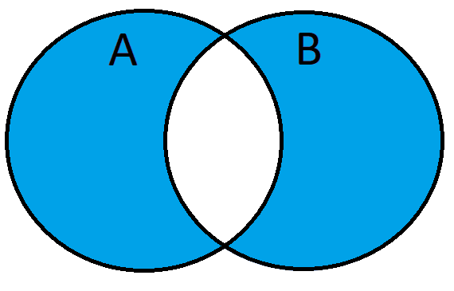

## **SQL Joins & Relationships**

### **INNER JOIN – Matching Records**
The `INNER JOIN` returns only records that have matching values in both tables.

**Example: Retrieve employees and their department names**
```sql
SELECT employees.first_name, employees.last_name, departments.dept_name
FROM employees
INNER JOIN departments ON employees.department_id = departments.department_id;
```


### **LEFT JOIN / RIGHT JOIN – Including Unmatched Records**
The `LEFT JOIN` returns all records from the left table and matching records from the right table. If no match exists, `NULL` is returned.

**Example: Retrieve all employees, even if they have no department**
```sql
SELECT employees.first_name, employees.last_name, departments.dept_name
FROM employees
LEFT JOIN departments ON employees.department_id = departments.department_id;
```


The `RIGHT JOIN` does the opposite, returning all records from the right table and matching ones from the left.

**Example: Retrieve all departments, even if they have no employees**
```sql
SELECT employees.first_name, employees.last_name, departments.dept_name
FROM employees
RIGHT JOIN departments ON employees.department_id = departments.department_id;
```


### **FULL OUTER JOIN – Combining Everything**
The `FULL OUTER JOIN` returns all records from both tables, with `NULL` for non-matching records.

**Example: Retrieve all employees and departments, showing unmatched ones**
```sql
SELECT employees.first_name, employees.last_name, departments.dept_name
FROM employees
FULL OUTER JOIN departments ON employees.department_id = departments.department_id;
```


### Left Excluding JOIN (LEFT JOIN with a WHERE clause)

This query will return all of the records in the left table (table A) that do not match any records in the right table (table B).

```sql
SELECT <select_list> 
FROM Table_A A
LEFT JOIN Table_B B
ON A.Key = B.Key
WHERE B.Key IS NULL
```


### Right Excluding JOIN (RIGHT JOIN with a WHERE clause)

This query will return all of the records in the right table (table B) that do not match any records in the left table (table A).

```sql
SELECT <select_list>
FROM Table_A A
RIGHT JOIN Table_B B
ON A.Key = B.Key
WHERE A.Key IS NULL
```


### Outer Excluding JOIN (FULL JOIN with a WHERE clause)

This query will return all of the records in the left table (table A) and all of the records in the right table (table B) that do not match.

```sql
SELECT <select_list>
FROM Table_A A
FULL OUTER JOIN Table_B B
ON A.Key = B.Key
WHERE A.Key IS NULL OR B.Key IS NULL
```



### **SELF JOIN – Joining a Table to Itself**
A `SELF JOIN` is used to compare rows within the same table.

**Example: Find employees and their managers (both stored in the `employees` table)**
```sql
SELECT e1.first_name AS employee, e2.first_name AS manager
FROM employees e1
INNER JOIN employees e2 ON e1.manager_id = e2.employee_id;
```

### **CROSS JOIN – Cartesian Product**
A `CROSS JOIN` returns all possible combinations of records between two tables.

**Example: Create all combinations of employees and projects**
```sql
SELECT employees.first_name, projects.project_name
FROM employees
CROSS JOIN projects;
```

## **Grouping & Aggregation**

### **GROUP BY – Grouping Data**
The `GROUP BY` statement groups rows that have the same values in specified columns.

**Example: Count employees in each department**
```sql
SELECT department_id, COUNT(*) AS employee_count
FROM employees
GROUP BY department_id;
```

### **HAVING – Filtering Grouped Results**
The `HAVING` clause filters grouped results (similar to `WHERE` but used with aggregation).

**Example: Get departments with more than 10 employees**
```sql
SELECT department_id, COUNT(*) AS employee_count
FROM employees
GROUP BY department_id
HAVING COUNT(*) > 10;
```

### **Aggregate Functions (COUNT(), SUM(), AVG(), MIN(), MAX())**
SQL provides several functions for performing calculations on data.

- **`COUNT()`** – Counts the number of rows.
- **`SUM()`** – Calculates the total sum of a column.
- **`AVG()`** – Computes the average value.
- **`MIN()` / `MAX()`** – Finds the smallest/largest value.

**Example: Get department statistics**
```sql
SELECT department_id,
       COUNT(*) AS employee_count,
       SUM(salary) AS total_salary,
       AVG(salary) AS average_salary,
       MIN(salary) AS lowest_salary,
       MAX(salary) AS highest_salary
FROM employees
GROUP BY department_id;
```

These SQL joins and aggregation techniques help in efficiently managing and analyzing relational data.

---
